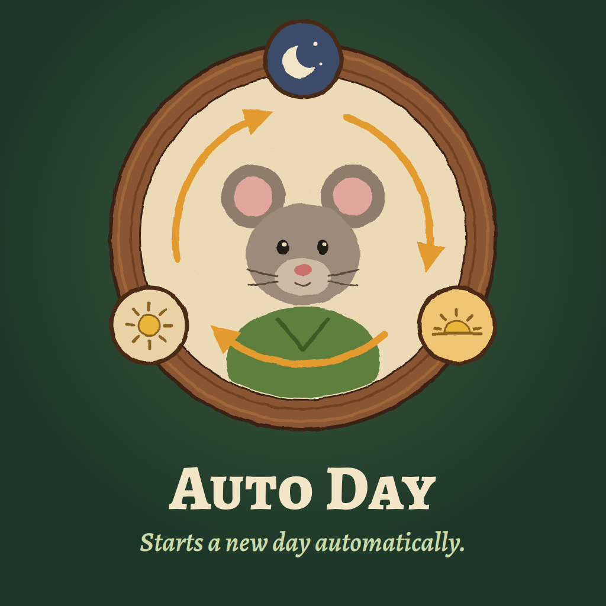

<div align="center">



# Auto Day

**Start Whiskerwood's next day automatically.**

</div>

Auto Day confirms the game's regular end-of-day prompt for you. It is
**enabled by default** and has one switch in the game's native mod settings.
Turn it off whenever you prefer to confirm each day yourself.

## How It Works

- Checks about once per second and waits while a window is open, the HUD is not
  ready, or the game reports saving or pending victory.
- Uses the normal NextDay action, with one attempt per calendar day and loaded
  session. Manual confirmation remains available if that attempt cannot advance.
- Leaves normal manual pauses during the day alone. At the end-of-day stop,
  NextDay may also clear a manual pause that happened at the same time, just as
  pressing the game's button would.

The setting is available in English and German; other game languages use English.

## Preview and Installation

**Windows preview `0.1.0-preview`. In-game validation is pending.**

For a prepared local package, close the game and place the `AutoDay` folder here:

```text
%LOCALAPPDATA%\Whiskerwood\Saved\mods\AutoDay\
  AutoDay.pak
  AutoDay.uplugin
```

Use one installation only. Avoid keeping a local copy alongside a Workshop copy.
Start the game normally; Auto Day is on by default.

[Build, verified installation, and test steps](docs/DEVELOPMENT.md)

---

Unofficial community mod built with the [Whiskerwood modkit](https://github.com/Whiskerwood-Modding/Whiskerwood-Project) by Buckminsterfullerene and Whiskerwood-Modding. Game assets belong to their respective owners.

[MIT license](LICENSE)

[](https://duoqueue.app/en/)
